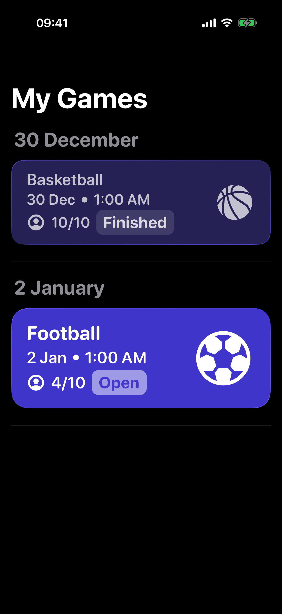
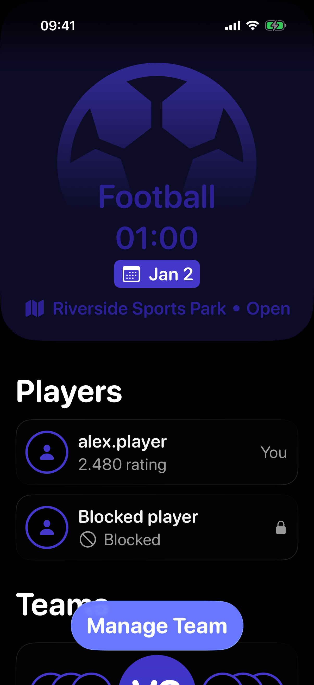
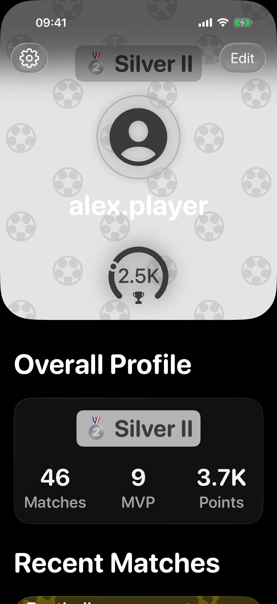
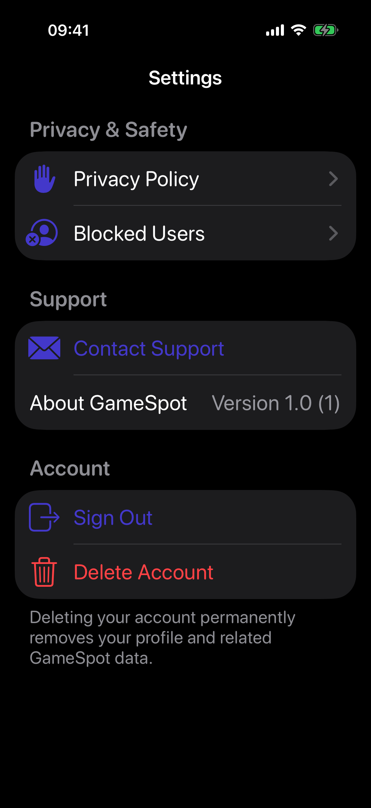

# GameSpot

GameSpot is a native iOS app for finding people to play football or basketball with at free outdoor sports courts. A player can discover a park, create or join a game, choose a team, follow the match lifecycle, vote for an MVP, and build a sport-specific rating.

This repository is a finished portfolio project. It demonstrates a complete SwiftUI client, a versioned Supabase backend, production-oriented security rules, and automated testing. It is not currently distributed through the App Store.

## Product tour

<p align="center">
  
  
  
  
</p>

The screenshots are generated from the real SwiftUI screens with deterministic local fixtures. They do not depend on a live account or production data.

## What it includes

- Email/password authentication, confirmation links, and password recovery.
- Onboarding, foreground location permission, and profile setup with avatar upload.
- MapKit park discovery, park details, opening hours, photos, and ratings.
- Game creation, My Games, team selection, Join/Leave, and Realtime refresh.
- Server-owned match lifecycle and a time-limited MVP voting flow.
- Global and per-sport statistics with ranks from Bronze to King.
- Open-Meteo weather for scheduled games.
- Unified own/public profiles, blocked-player placeholders, reporting, and blocking.
- Settings with privacy policy, support, sign out, and permanent account deletion.
- Loaded, empty, error, retry, and accessibility-aware loading states.

## Technology

| Area | Technology |
| --- | --- |
| Client | Swift 6, SwiftUI, Swift Concurrency |
| Apple frameworks | MapKit, Core Location, PhotosUI |
| Backend | Supabase Auth, Postgres, RPC, RLS, Realtime, Storage, Edge Functions |
| Scheduling | `pg_cron` |
| Weather | Open-Meteo REST API |
| Dependencies | Swift Package Manager, `supabase-swift` 2.44.1 |
| Verification | XCTest, XCUITest, SQL regression tests |

The app targets iOS 26.0 or newer.

## Architecture

```text
SwiftUI View
    ↓ user action / task / binding
@MainActor ViewModel
    ↓ async/await through a narrow protocol
Service or Realtime service
    ├── Supabase Swift SDK → Auth / PostgREST / RPC / Storage / Realtime
    ├── URLSession          → Open-Meteo
    └── CoreLocation        → foreground location on device
```

Views own presentation and navigation. ViewModels orchestrate async work and publish explicit UI state. Small service protocols make the important flows deterministic in tests. Postgres remains the source of truth for ownership, game capacity, match state, voting, rewards, and account cleanup.

Realtime events are treated as invalidation signals: the client receives an event, then reloads an authoritative RPC or table result instead of rebuilding domain state from partial payloads.

More detail is available in [Architecture](docs/ARCHITECTURE.md), [Database](docs/DATABASE.md), [Features](docs/FEATURES.md), and [Architecture decisions](docs/DECISIONS.md).

## Engineering highlights

- Least-privilege RLS and explicit grants protect games, memberships, votes, statistics, reports, and blocks.
- Privileged mutations go through server-side RPCs with ownership and lifecycle checks.
- Match rewards and MVP processing are idempotent.
- Avatar upload is retry-safe and constrained by path, MIME type, and size.
- Account deletion is handled by a JWT-protected Edge Function and removes related database and Storage data.
- Authenticated UI journeys were verified with disposable accounts that were removed after testing.
- Forty-two isolated SwiftUI previews cover screens, reusable components, and error/empty states without network access.

## Run locally

Requirements: macOS with Xcode 26.4 or newer, an iOS 26 simulator, Git, and internet access for Swift Package Manager and the hosted APIs.

```bash
git clone https://github.com/Kotyarya/GameSpot.git
cd GameSpot
open "Game Spot.xcodeproj"
```

Select the `Game Spot` scheme and an iOS 26 simulator, then run the app. Swift Package Manager resolves the dependencies automatically.

The client reads `SupabaseURL` and `SupabasePublishableKey` from `Game-Spot-Info.plist`. A publishable/anon key is appropriate for a client application; service-role keys, database passwords, access tokens, and test credentials must never be added to the app or Git.

For a different Supabase project, replace the two public client values and apply the versioned migrations. The exact setup, local backend, physical-device, and test instructions are in [Setup](docs/SETUP.md).

## Verification

Run the unit target:

```bash
xcodebuild test \
  -project "Game Spot.xcodeproj" \
  -scheme "Game Spot" \
  -destination 'platform=iOS Simulator,name=iPhone 17 Pro,OS=26.5' \
  -only-testing:'Game SpotTests'
```

Build the Release configuration without signing:

```bash
xcodebuild build \
  -project "Game Spot.xcodeproj" \
  -scheme "Game Spot" \
  -configuration Release \
  -destination 'generic/platform=iOS Simulator' \
  CODE_SIGNING_ALLOWED=NO
```

For backend verification, start the local Supabase stack, reset it from the migration history, and run the scripts in `supabase/tests/database/`. Never reset the hosted project.

Current verification evidence:

- Release simulator build: passed.
- Full unit target on iPhone 17 Pro / iOS 26.5: passed.
- Authenticated tab navigation, profile/settings, reporting/blocking, and account-deletion journeys: passed during production QA with disposable accounts.
- Local schema reset, database regression tests, and Supabase security checks: passed.

## Repository structure

```text
Game Spot/
├── AppState/          # session state and navigation
├── Core/              # models, services, managers, configuration
├── Features/          # Auth, Map, Games, Profile, Settings
├── UI/                # shared visual components
├── PreviewSupport/    # deterministic screen/component previews
└── Debug/             # UI-test and portfolio screenshot harnesses

Game SpotTests/        # unit and ViewModel tests
Game SpotUITests/      # UI tests and authenticated journeys
supabase/
├── migrations/        # reproducible schema, RLS, functions, and indexes
├── functions/         # account-deletion Edge Function
└── tests/database/    # SQL regression suite
docs/                  # architecture, setup, backend, decisions, and screenshots
```

## Documentation

- [Project setup](docs/SETUP.md)
- [Architecture](docs/ARCHITECTURE.md)
- [Database and backend](docs/DATABASE.md)
- [Feature flows](docs/FEATURES.md)
- [Architecture decisions](docs/DECISIONS.md)
- [SwiftUI preview catalog](docs/PREVIEWS.md)
- [Changes since the original version](docs/CHANGES_SINCE_USER_VERSION.md)
- [Moderation runbook](docs/MODERATION.md)
- [Privacy Policy](docs/privacy-policy.md)

Public Privacy Policy: <https://kotyarya.github.io/GameSpot/>

Support: `gamespot.support@icloud.com`

## Scope and status

GameSpot is complete as a portfolio application. Monetization, analytics, push notifications, offline mode, background location, and social-feed expansion are intentionally outside the current scope. TestFlight and App Store publication are also not required for this version.

The only optional QA item left is one uninterrupted manual two-account walkthrough from clean installation through registration, onboarding, park discovery, game creation, Join/Leave, match completion, and MVP voting. The individual parts have already been covered by unit tests, UI tests, and production E2E checks.

## Author

Created by Maksim Aksamitnyi as an iOS diploma and portfolio project. The release-hardening history is documented in [Changes since the original version](docs/CHANGES_SINCE_USER_VERSION.md).
